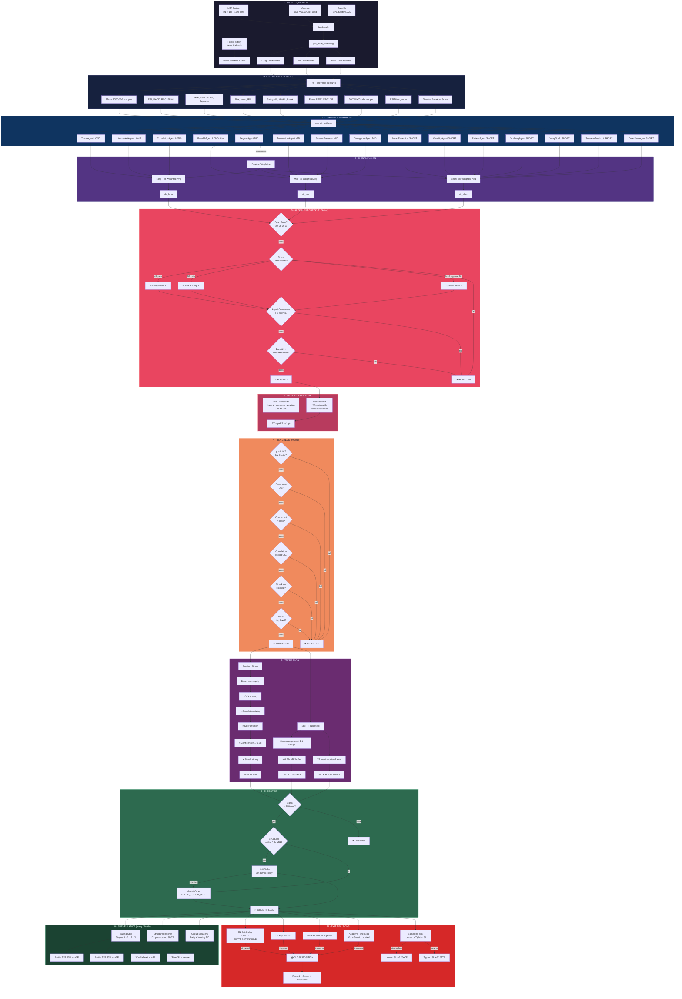

# TradingAgents-v2: Full Decision Pipeline

## Mindmap

```mermaid
mindmap
  root((Trading Bot<br/>Decision Pipeline))
    **1. DATA ACQUISITION**
      DataLoader
        MT5 Bars via copy_rates
          Long tier: 1D bars x60
          Mid tier: 1H/4H bars x300
          Short tier: 15m bars x300
        Macro Data via yfinance 5min cache
          DXY Dollar Index
          VIX Fear Index
          Crude Oil CL=F
          US 10Y Yield ^TNX
        Breadth Data via yfinance 1hr cache
          SPY / RSP ratio
          Sector ETFs momentum
          Advance/Decline
        News Calendar
          ForexFactory HTTP fetch
          High-impact event schedule
        Simulation Mode
          Random-walk synthetic bars
      get_multi_features parallel
        ThreadPoolExecutor 3 workers
        Returns long + mid + short features
    **2. FEATURE ENGINE**
      35+ Technical Features
        Moving Averages
          EMA 20 / 50 / 200
          6-bar slopes
        Momentum
          RSI 14 + RSI 4 Wilders
          MACD histogram + delta
          ROC 10-bar
          Bollinger %B
        Volatility
          ATR 14 + ATR 5
          Realized vol annualised
          BB width + Keltner width
        Trend Regime
          ADX 14
          Hurst exponent R/S
          RVI
          ATR/price ratio
        Structure
          Swing highs/lows detection
          HH/HL + LH/LL counts
          Last structural break
        Session
          Asian range breakout score
          VWAP + distance in ATR
        Divergences
          RSI regular + hidden
          Bull + bear scores
        Pivots
          Weekly PP/R1/R2/S1/S2
          D1 swing nodes merged
          Nearest support/resist
        Macro Mapped
          DXY direction per symbol
          VIX direction per symbol
          Crude + Yield mapped
        Correlation
          DXY divergence
          Peer pair divergence
          Risk divergence
    **3. AGENT SYSTEM**
      16 Agents in Parallel
        LONG Tier Agents
          TrendAgent
            EMA stack + ADX + structure
          IntermarketAgent
            DXY + VIX + Crude + Yields
          BreadthAgent filter only
            Market health context
          CorrelationAgent
            Cross-symbol divergences
          LLMSentimentAgent optional
            External LLM pipeline
        MID Tier Agents
          RegimeAgent
            Trend vs Range detection
            Outputs trendiness score
          MomentumAgent
            RSI regime + MACD accel
          SessionBreakoutAgent
            Asian range + session timing
          DivergenceAgent
            RSI divergence patterns
        SHORT Tier Agents
          MeanReversionAgent
            BB extension + VWAP stretch
          VolatilityAgent
            Vol expansion/contraction
          PatternAgent
            Swing patterns + breakouts
          ScalpingAgent
            Ultra-short momentum
          VwapScalpAgent
            VWAP mean-rev/breakout
          SqueezeBreakoutAgent
            BB inside Keltner squeeze
          OrderFlowAgent
            Volume commitment proxy
      Each outputs
        dir_score in neg1 to 1
        confidence in 0 to 1
        evidence dict
    **4. SIGNAL FUSION**
      _fuse_timeframes
        Regime Detection
          trendiness from RegimeAgent
          TREND above 0.55 / RANGE below 0.40
        Counter-Trend Muting
          MeanReversion dampened in trends
          Divergence dampened in trends
        Regime Weighting per Agent
          TrendAgent 2.0x trending / 0.4x ranging
          MeanRev 0.1x trending / 1.8x ranging
          10+ agent-specific multipliers
        Correlation Auto-Weighting
          10 agent pairs with corr factors
          Dampens when correlated agents agree
        Tier Weighted Average
          score = Sum dir x conf x weight x regime x corr
          Disagreement dampening
          Consensus fraction scaling
        Trendiness Dampening per Tier
          LONG barely affected
          MID moderate dampening
          SHORT strongest dampening
        Output TimeframeFusion
          dir_long / dir_mid / dir_short
          confidence per tier
          alignment_strength
          regime_trendiness
    **5. ALIGNMENT CHECK**
      11 Sequential Gates
        Blocked Hours UTC
        Dead Zone 22-06 UTC
          Raises thresholds x1.4
        Open Zone filter
          London/NY false breakout
        Score Thresholds
          long_min_score 0.15-0.20
          mid_min_score 0.12-0.15
          short_min_score 0.06-0.08
        Full Alignment
          All 3 tiers agree above threshold
        Pullback Entry
          D1 strong + M/S not opposing
          pullback_tolerance 0.12-0.15
        Breadth Gate
          breadth_score above -0.50
        MeanReversion Block
          Bearish MR blocks longs
        D1 ADX Gate
          Block if ADX below minimum
        Agent Consensus Gate
          min 2-3 agents must vote same way
        Counter-Trend Scalp
          D1 clear + MID/SHORT oppose
          Separate thresholds + penalty
      Entry Types
        full-alignment
        pullback-entry
        counter-trend-scalp
        REJECTED
    **6. RECIPE GENERATION**
      TradeRecipe
        Direction long/short
        Win Probability
          Base 0.42-0.47 by entry type
          + signal strength bonuses
          + breadth/trendiness modifiers
          - diversity/empty-tier penalties
          Clamped 0.35 to 0.80
        Risk Reward Ratio
          Standard 2.0 + strength x 0.5
          CT scalp 1.0 to 1.5
          Spread-corrected net RR
        Expected Value
          EV = p x RR - 1-p
          Must exceed min_ev 0.10
    **7. RISK CHECK**
      9 Sequential Gates
        Min Win Probability 0.46
        Min Expected Value 0.10
        Min Confidence 0.48-0.50
        Daily Drawdown Limit
        Max Concurrent Trades
        Currency Correlation Guard
          USD/JPY/EUR bucket counting
          Max 2-3 per bucket
        Scale-In Evaluation
          Max positions per symbol
          Require profit + min R
          Direction must match
        Losing Streak Guard
          2 consecutive losses block symbol
          Escalating cooldown 4-24h
        Key Level Proximity
          No LONG into resistance
          No SHORT into support
          Buffer 0.5 x ATR
    **8. TRADE PLAN**
      Position Sizing Cascade
        Base risk pct x equity
        Concentration scaling
        Per-symbol multiplier
        VIX fear scaling
        Correlation-aware sizing
        Kelly criterion
        Confidence sizing 0.7-1.3x
        Short-side penalty
        Streak-momentum sizing
        Holiday damper Dec 22-Jan 2
      SL/TP Computation
        Structural Levels
          Weekly pivots + D1 swings
          Nearest support/resist
          0.25 x ATR buffer
        ATR-Based Floor
          Min 1.5 x ATR stop distance
        Max SL Cap
          3.5-5.0 x ATR ceiling
        Structural TP
          Next level on profit side
          Strong trend skip to 2nd level
        Min RR Floor
          TP at least 1.0-1.5 x SL
      Lot Calculation
        risk / stop_distance x tick math
        Clamped to broker min/max/step
        Max lot hard ceiling
    **9. TRADE EXECUTION**
      Signal Freshness Check
        Reject if signal older than 180s
      Limit Order Attempt
        Structural level within 0.3 x ATR
        Place limit with 30-40min expiry
        Falls back to market on reject
      Market Order
        TRADE_ACTION_DEAL
        Bracket with SL + TP
        Spread guard 20%
        Tick freshness check
      Post-Execution
        Register in OrderManager
        Track known tickets
        Record agent votes
        Update cooldown + daily count
        Persist state to disk
    **10. SURVEILLANCE LOOP**
      Every 10-60s depending on TF
        Weekend Close
          Friday past cutoff close all
        Trailing Stop Manager
          Early BE at 0.5R
          Stage 1 at 1R breakeven
            Partial TP1 close 50%
          Stage 2 at 1.5R lock 0.5R
          Stage 3 at 2R+ ATR trail
            Partial TP2 close 35%
          Windfall Exit at 3-4R
          Stale SL Progressive Squeeze
          Peak Profit Protection
        Structural SL/TP Ratchet
          D1-scale ATR for buffer
          Pivot-aware SL raise/TP push
          Only ratchets never widens
        Circuit Breakers
          Daily DD close all
          Weekly DD close all
        Ticket Reconciliation
          Detect MT5-native SL/TP fills
          Update streak + journal
    **11. EXIT DECISIONS**
      _check_and_close_positions
        RL Exit Policy first
          Heuristic or ONNX model
          EXIT / TIGHTEN / HOLD
        Scalp Exits
          Short-tier flip
          Mid+Short opposition
        Swing Exits
          D1 Flip against trade
          Conviction Fade optional
          Mid+Short Strong Opposition
          CT Mid Flip for counter-trend
        Adaptive Time-Stop
          Base 16h risky / 10h balanced
          High vol +30% / Low vol -20%
          Asian session -25%
        Signal Re-Evaluation
          Strengthened: loosen SL 0.25 ATR
          Weakened: tighten SL 0.15 ATR
        Tighten-on-Fade
          SL to breakeven
          TP to price +/- 0.5 ATR
        Streak Guard on Close
          2 losses trigger cooldown
          Escalating 4h to 24h
    **12. THREE ASYNC LOOPS**
      Signal Loop
        Runs _run_cycle per interval
        Ranked mode dry-run all symbols
        rank_and_select top EV
        Execute winners only
      Surveillance Loop
        SL management + exits
        Independent faster cadence
      Watchdog Loop
        MT5 heartbeat every 90s
        Reconnect with exp backoff
        Stale-SL last resort
```

## Flow Diagram

---

## Detailed Pipeline Reference

### 1. Data Acquisition (`tradingagents_v2/data/loader.py`)

| Source | Method | Cache | Data |
|--------|--------|-------|------|
| MT5 Broker | `copy_rates()` | None (live) | OHLCV bars: D1×60, 1H×300, 15m×300 |
| yfinance | `_macro_features()` | 5 min | DXY, VIX, Crude (CL=F), 10Y Yield (^TNX) |
| yfinance | `_breadth_features()` | 1 hr | SPY/RSP, sector ETFs, advance/decline |
| ForexFactory | HTTP fetch | Per-cycle | High-impact news events |
| Simulation | `_synthetic_bars()` | N/A | Random-walk OHLCV |

### 2. Technical Features (`TechnicalFeatures` — 35+ fields)

| Category | Features |
|----------|----------|
| Moving Averages | EMA 20/50/200, 6-bar slopes |
| Momentum | RSI 14, RSI 4, MACD histogram + delta, ROC 10, Bollinger %B |
| Volatility | ATR 14, ATR 5, realized vol, BB width, Keltner width |
| Trend/Regime | ADX 14, Hurst exponent, RVI, ATR/price ratio |
| Structure | Swing highs/lows, HH/HL count, LH/LL count, last break |
| Session | VWAP + distance (ATR units), Asian range breakout score |
| Divergences | RSI regular + hidden, bull/bear scores |
| Pivots | Weekly PP/R1/R2/S1/S2, D1 swing nodes, nearest support/resist |
| Macro | DXY/VIX/Crude/Yield direction (per-symbol mapped) |
| Correlation | DXY divergence, peer-pair divergence, risk divergence |

### 3. Agent System (16 agents)

| Agent | Tier | Key Inputs | What It Measures |
|-------|------|-----------|-----------------|
| TrendAgent | LONG | EMA stack, ADX, swing structure | Multi-EMA trend + structural confirmation |
| IntermarketAgent | LONG | DXY, VIX, Crude, Yield | Macro bias from intermarket flows |
| BreadthAgent | LONG | SPY, sectors, A/D | Market health (filter, not directional) |
| CorrelationAgent | LONG | DXY/peer/risk divergences | Cross-symbol divergence scoring |
| LLMSentimentAgent | LONG | External LLM | News/sentiment (optional) |
| RegimeAgent | MID | ADX, Hurst, ATR ratio, RVI | Trend vs range regime detection |
| MomentumAgent | MID | RSI, MACD, ROC, BB%b, ADX | RSI regime logic, MACD acceleration |
| SessionBreakoutAgent | MID | Session break score, EMA, ATR | Asian range breakout + session timing |
| DivergenceAgent | MID | RSI divergences, MACD | Regular/hidden RSI divergence patterns |
| MeanReversionAgent | SHORT | BB%b, Keltner, RSI, VWAP, ADX | BB extension, VWAP stretch, RSI extremes |
| VolatilityAgent | SHORT | ATR, BB/Keltner width, vol | Vol expansion/contraction, squeeze detection |
| PatternAgent | SHORT | Swing H/L, BB%b, ATR, EMAs | Swing patterns, breakouts, S/R tests |
| ScalpingAgent | SHORT | RSI 4, MACD delta, ATR 5 | Ultra-short momentum for 1m entries |
| VwapScalpAgent | SHORT | VWAP distance, RSI 4, ADX | VWAP mean-reversion/breakout |
| SqueezeBreakoutAgent | SHORT | BB/Keltner widths, ROC, MACD | BB-inside-Keltner squeeze → breakout |
| OrderFlowAgent | SHORT | BB%b, ROC, vol, ATR, VWAP | Volume-weighted candle commitment proxy |

Each agent outputs: `dir_score ∈ [-1, +1]`, `confidence ∈ [0, 1]`, `evidence dict`

### 4. Signal Fusion (`graph.py → _fuse_timeframes`)

1. **Regime detection** — trendiness from RegimeAgent (>0.55 = trending, <0.40 = ranging)
2. **Counter-trend muting** — MeanReversion dampened to ~10% weight in strong trends
3. **Regime weighting** — per-agent multipliers (e.g., TrendAgent 2.0× trending / 0.4× ranging)
4. **Correlation auto-weighting** — dampens when correlated agents agree
5. **Tier weighted average** — `Σ(dir × conf × weight × regime × corr) / Σ(conf × weight × ...)`
6. **Disagreement dampening** — consensus fraction scaling
7. **Output**: `dir_long`, `dir_mid`, `dir_short` + confidences + alignment_strength

### 5. Alignment Check (`graph.py → _check_alignment` — 11 gates)

| Gate | Description |
|------|-------------|
| Blocked hours | Hard-block specific UTC hours |
| Dead zone | 22:00-06:00 UTC → thresholds × 1.4 |
| Open zone | London/NY open false-breakout filter |
| Score thresholds | long >0.15, mid >0.12, short >0.06 |
| Full alignment | All 3 tiers agree → `full-alignment` |
| Pullback entry | D1 strong + M/S not opposing → `pullback-entry` |
| Counter-trend | D1 clear + M+S oppose → `counter-trend-scalp` |
| Breadth gate | breadth_score ≥ -0.50 |
| MeanReversion block | Bearish MR blocks longs, bullish blocks shorts |
| D1 ADX gate | Block if daily ADX too low |
| Agent consensus | ≥ 2 agents voting same direction |

### 6. Recipe Generation (`graph.py → _generate_recipe`)

- **Win probability**: base (0.42-0.47) + signal strength + breadth/trendiness modifiers − penalties → clamped [0.35, 0.80]
- **Risk:Reward**: 2.0 + strength×0.5 (standard), 1.0-1.5 (CT scalp), spread-corrected
- **Expected value**: `EV = p × RR − (1 − p)` — must exceed `min_ev` (0.10)

### 7. Risk Check (`graph.py → _risk_check` — 9 gates)

| Gate | Threshold |
|------|-----------|
| Min win probability | ≥ 0.46 |
| Min expected value | ≥ 0.10 |
| Min confidence | ≥ 0.48-0.50 |
| Daily drawdown | Within limit |
| Max concurrent trades | 6-14 depending on profile |
| Currency correlation | Max 2-3 per USD/JPY/EUR bucket |
| Scale-in check | Max per symbol, require profit, direction match |
| Streak guard | 2 losses → block symbol 4-24h |
| Key level proximity | No LONG into resistance, no SHORT into support (0.5×ATR buffer) |

### 8. Trade Plan (`graph.py → _create_plan`)

**Position sizing cascade** (10 steps):
1. Base risk % × equity
2. × concentration scaling
3. × per-symbol risk multiplier
4. × VIX fear scaling
5. × correlation-aware sizing
6. × Kelly criterion
7. × confidence sizing (0.7–1.3×)
8. × short-side penalty
9. × streak-momentum sizing
10. × holiday damper (Dec 22–Jan 2)

**SL/TP placement**:
- SL: nearest structural level (pivots + D1 swings) + 0.25×ATR buffer, floor at 1.5×ATR, cap at 3.5-5×ATR
- TP: next structural level on profit side (skip to 2nd if ADX>40), min R:R floor 1.0-1.5

### 9. Trade Execution (`graph.py → _execute_trade`)

1. Signal freshness check (< 180s)
2. Limit order attempt if structural level within 0.3×ATR (30-40min expiry)
3. Market order fallback (`TRADE_ACTION_DEAL` with bracket SL+TP)
4. Post: register order, track tickets, record agent votes, update cooldowns, persist state

### 10. Surveillance Loop (`runner.py → _surveillance_loop` — every 10-60s)

| Step | Action |
|------|--------|
| Weekend close | Friday past cutoff → close all |
| Trailing stops | Stages: early BE → +1R partial TP1 → +1.5R lock → +2R ATR trail + partial TP2 → windfall |
| Structural ratchet | D1-scale ATR, pivot-aware SL raise / TP push (never widens) |
| Circuit breakers | Daily + weekly drawdown → close all |
| Ticket reconciliation | Detect MT5-native SL/TP fills, update streak + journal |

### 11. Exit Decisions (`runner.py → _check_and_close_positions`)

| Condition | Trigger | Profile Default |
|-----------|---------|-----------------|
| RL exit policy | Heuristic score > threshold | EXIT/TIGHTEN/HOLD |
| D1 flip | dir_long opposes trade > 0.45 | Balanced + Risky |
| Conviction fade | \|dir_long\| < 0.10 | Disabled by default |
| Mid+Short opposition | Both oppose > 0.42-0.45 | Enabled |
| CT mid flip | dir_mid opposes CT trade > 0.60 | CT trades only |
| Adaptive time-stop | Base 10-16h, ×vol, ×session | Enabled |
| Signal re-eval | Strengthen → loosen SL; weaken → tighten SL | Enabled |
| Tighten-on-fade | SL→BE + TP tightened | Disabled (balanced/risky) |

### 12. Three Async Loops

| Loop | Interval | Purpose |
|------|----------|---------|
| Signal loop | Profile-dependent (60s–5min) | `_run_cycle()` — rank symbols, execute best |
| Surveillance loop | 10-60s (TF-dependent) | SL management + exit checks |
| Watchdog loop | 90s | MT5 heartbeat, reconnect, stale-SL last resort |
